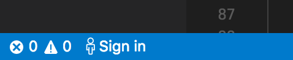
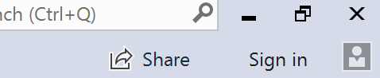
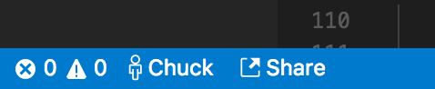
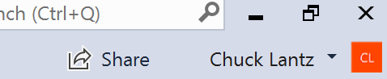

<!--
Copyright © Microsoft Corporation
All rights reserved.
Creative Commons Attribution 4.0 License (International): https://creativecommons.org/licenses/by/4.0/legalcode
-->

# Working with collaboration sessions in Live Share

In this article, we'll run you through series of detailed how-tos that will help you work with collaboration sessions in Visual Studio Live Share. Information on concepts or installing Visual Studio Live Share can be [found in the overview](getting-started.md).

If you're looking for an abridged version, check out the [share](quick-start-share.md) and [join](quick-start-join.md) quickstarts.

## Sign into Visual Studio Live Share

In order to collaborate, you'll need sign into Visual Studio Live Share so everyone knows who you are. This is purely a security measure and does not opt you into any marketing or other research activities. Signing in is easy.

### Sign in from Visual Studio Code

For Visual Studio Code, you can hit **Ctrl+Shift+P** and select the "Live Share: Sign in" command or simply click on the "Sign in" status bar item and follow the directions to sign in.

 

A browser will appear where you can complete the sign-in process.If you're been accepted into the private limited preview (session hosts), **use the same  credentials you used to sign up**.

If you are running into problems with VS Code not picking up a successful sign-in, click on the "Having trouble" link on the success screen in the browser and follow the directions. Check out [troubleshooting](troubleshooting.md#sign-in) for more tips.

### Sign in from Visual Studio

By default Visual Studio uses the your [personalization account](https://docs.microsoft.com/en-us/visualstudio/ide/signing-in-to-visual-studio) so if you're already logged into Visual Studio, you may be able to skip this step. Otherwise sign as you would normally.

If you've been accepted into the private limited preview (session hosts) and want to share, you should **sign in using the same credentials you used to sign up**. If you need to use a different sign-in than your VS [personalization account](https://docs.microsoft.com/en-us/visualstudio/ide/signing-in-to-visual-studio) (e.g. you signed up for the private limited preview using a GitHub account), go to **Tools &gt; Options &gt; Live Share &gt; User account** to switch credentials.

Selecting **External Account** allows you to select an account not supported by Visual Studio's personalization feature like GitHub. A browser will automatically appear the first time you use a Live Share feature so you may complete sign in.

If you run into trouble, check out [troubleshooting](troubleshooting.md#sign-in) for more tips.

## Share a project

After downloading and installing Visual Studio Live Share, follow these steps to start a collaboration session and invite a colleague to work with you.

#### 1. Sign up for the preview

In order to start a collaboration session while Visual Studio Live Share is in private limited preview, you'll need to be signed up and accepted into the preview to be able to share. Visual Studio users should use their [personalization account](https://docs.microsoft.com/en-us/visualstudio/ide/signing-in-to-visual-studio) credentials to sign up.

> **Note:** _This step is only necessary in order to "share". Anyone can "join" a collaboration session as a guest. This makes it easy for folks to work together without everyone needing to explicitly sign up or be accepted into the preview._

If you have not done so, **[sign up now!](https://aka.ms/vsls-signup)** 

#### 2. Sign in

Once you've been accepted into the preview, sign into Visual Studio Live Share with the credentials you used to sign-up. See [sign into Visual Studio Live Share](#sign-into-visual-studio-live-share).

#### 3. Start a collaboration session

Open a folder, project, or solution you want to share and simply click the "Share" button (VS) / status bar icon (VS Code) in your tool.

<table style="border: none;">
<tr style="border: none;">
    <td width="50%" style="border: none;">
        <strong>Visual Studio Code</strong>
    </td>
    <td width="50%" style="border: none;">
        <strong>Visual Studio</strong>
    </td>
</tr><tr style="border: none;">
    <td width="50%" style="vertical-align: top; border: none;">
        
    </td>
    <td width="50%" style="vertical-align: top; border: none;">
        
    </td>
</tr>
</table>

If you're using VS Code, you can also hit **Ctrl+Shift+P** and select the "Live Share: Start a collaboration session (Share)" command instead.

> **Note:** You may be asked by your desktop firewall software to allow the Live Share agent to open a port the first time you share. Accepting this is entirely optional but enables a secured "direct mode" to improve performance when the person you are working with is on the same network as you are. See [change the connection mode](#change-the-connection-mode) for details.

An invite link will be automatically copied to your clipboard. When opened in a browser, this link allows others to join a new collaboration session that shares contents of these folders with them.

You will also see the "Share" button / status bar icon transition to convey a "Session State". See [understand the session state](#understand-the-session-state) for more information on what this looks like.

Note that if you need to get the invite link again after you've started sharing, you access it again as follows:

- **VS:** Click on the share / session state button and select "Copy Link"  
- **VS Code**: Click the session state status bar icon and select "Invite Others (Copy Link)".

#### 4. Send someone the link

Send the link over e-mail, Slack, Skype, etc. and once they join you can start collaborating! The person you invite will be able to download, install needed tools, and join the collaboration session without having to sign up or be accepted into the preview.

That's it!!

### End the collaboration session

As a host, you can can stop sharing completely and end the collaboration session by clicking the session state button (in the upper right hand corner in VS or the status bar in VS Code) and selecting "End Collaboration Session". All guests will be notified that the session has ended.

<table style="border: none;">
<tr style="border: none;">
    <td width="50%" style="border: none;">
        <strong>Visual Studio Code</strong>
    </td>
    <td width="50%" style="border: none;">
        <strong>Visual Studio</strong>
    </td>
</tr><tr>
    <td width="50%" style="vertical-align: top; border: none;">
         
         
         
    </td>
    <td width="50%" style="vertical-align: top; border: none;">
        
    </td>
</tr>
</table>

In VS Code, you can also hit **Ctrl+Shift+P** and select the "Live Share: End collaboration session" command instead.

Once the session has ended, guests will no longer be able to access the content and any temp files are automatically cleaned up.

### Troubleshooting

Having issues with sharing? Check out [troubleshooting](troubleshooting.md#share-and-join).

## Join a collaboration session

After downloading and installing Visual Studio Live Share, you or a colleague can follow these steps to join a hosted collaboration session as a guest.

### Join via the browser

The easiest way to join a collaboration session is to simply open the invite link in a web browser. Here's what you can expect when you follow this flow.

#### 1. Start a discussion with the Collaboration Session Host

It's always good to start up a conversation via voice or chat in your favorite client before joining a collaboration session since you'll obviously need to communicate to collaborate. In addition, as [outlined in the overview](getting-started.md#collaboration-sessions) the collaboration session requires the session host to be connected to the service to operate so you'll want to check in with them.

#### 2. Click on the invite link / open the invite in your browser

After installing Visual Studio Live Share for your tool, simply open (or re-open) the invite web page using the invite link your colleague sent you. 

If you have not yet installed the Live Share extension, you'll be prompted to do so at this point and be presented with links to the extension marketplace. Install the extension and restart your tool and browser.

> **Troubleshooting Tip:** When using VS Code, be sure you've **started the tool at least once** after installing the Visual Studio Live Share extension before opening/re-opening the invite page. Still having trouble? See [join manually](#join-manually).

You should be notified that your browser wants to launching your Visual Studio Live Share enabled tool. Accept this and a new window for your tool will launch and connect you to the session.

#### 3. Sign in

To let other collaborators know who you are, you may be asked to sign in during the join process using a GitHub or Microsoft account if you are not already signed in. See [sign into Visual Studio Live Share](#sign-into-visual-studio-live-share). You **do not need to be signed up or accepted into the private limited preview** to participate in a collaboration session and will not receive email updates by simply signing into a collaboration session.

#### 4. Collaborate

That's it!! In a few moments you'll be connected and you can start collaborating.

After joining, you will see the "Share" button (VS) / status bar icons (VS Code) transition to convey a "Session State". See [understand the session state](#understand-the-session-state) for more information on what this looks like.

### Join manually

You can also manually join from within VS or VS Code (rather than clicking on an invite link) which can be useful in situations where the tool you want to use is already running, you want to use a different tool than you usually do, or if you are having trouble with getting invite links to work for some reason. The process is easy:

#### 1. Sign in

See [sign into Visual Studio Live Share](#sign-into-visual-studio-live-share) if you have not already. You do not need to be part of the private limited preview to join a collaboration session.

#### 2. Use the join command

The location of the manual join command differs between Visual Studio Code and Visual Studio.

<table style="border: none;">
<tr style="border: none;">
    <td width="50%" style="border: none;">
        <strong>Visual Studio Code</strong>
    </td>
    <td width="50%" style="border: none;">
        <strong>Visual Studio</strong>
    </td>
</tr><tr>
    <td width="50%" style="vertical-align: top; border: none;">
        Hit <strong>Ctrl+Shift+P</strong> and select "Live Share: Join collaboration session" or click on the sign in/session state status bar item after signing in and select "Join Collaboration Session". 
         
         
         
    </td>
    <td width="50%" style="vertical-align: top; border: none;">
        Simply go to <strong>File > Join Collaboration Session.</strong> 
         
        
    </td>
</tr>
</table>

#### 3. Paste the invite link

Paste in the invite URL you were sent and confirm.

That's it! You should be connected to the collaboration session momentarily.

### Leave the collaboration session

As a guest, you can leave the collaboration session without ending it for others by simply closing the tool or by clicking the session state button (in the upper right hand corner in VS or the status bar in VS Code) and selecting "Leave Collaboration Session".

<table style="border: none;">
<tr style="border: none;">
    <td width="50%" style="border: none;">
        <strong>Visual Studio Code</strong>
    </td>
    <td width="50%" style="border: none;">
        <strong>Visual Studio</strong>
    </td>
</t><tr>
    <td width="50%" style="vertical-align: top; border: none;">
         
         
         
    </td>
    <td width="50%" style="vertical-align: top; border: none;">
        
    </td>
</tr>
</table>

In VS Code, you can also hit **Ctrl+Shift+P** and select the "Live Share: Leave collaboration session" command instead.

Any temp files are automatically cleaned up so no further action is needed.
### Troubleshooting

Having issues with sharing? Check out [troubleshooting](troubleshooting.md#share-and-join).

## Change the connection mode

To ensure optimal performance, by default Visual Studio Live Share automatically detects whether a collaboration session host machine and guest machine can communicate directly over a network and only relays via the cloud if there is no route between them. This mixed "auto" mode is flexible and even allows some guests to relay through the cloud while others connect directly for the same session.

The direct connections are authenticated via a cloud based mechanism to ensure security but require a port between 5990 and 5999 be opened to enable the connectivity. As a result, when sharing for the first time your desktop firewall may prompt you open a port. Accepting this is optional as ignoring it will simply cause Live Share to always use the relay when in auto mode.

If you would prefer to disable direct connections or are running into problems with auto mode you can force other connection modes.

| Mode | Host Behavior | Guest Behavior |
|------|----------------|----------------------|
| Auto | The host's collaboration session accepts secured, authenticated direct connections or cloud relayed connections. | Attempts to use a direct connection and falls back to relaying through the cloud if this fails. |
| Direct | The host's collaboration session only accepts authenticated, secure direct connections. | Attempts to use a direct connection and stops if it cannot connect. |
| Relay | The host's collaboration session does not allow direct connections. No port is opened on the host's machine. | Always connects via the cloud. |

To change the mode:

- **VS:** Go to Tools > Options > Live Share, select the mode from the "Connection Mode" dropdown and then restart VS.
- **VS Code:** Edit settings.json (File > Preferences > Settings) and add one of the following and then restart VS Code:
  - ``"liveshare.connectionMode":"auto"``
  - ``"liveshare.connectionMode":"direct"``
  - ``"liveshare.connectionMode":"relay"``

Having issues with connectivity? Check out [troubleshooting](troubleshooting.md#connectivity).

## Understand the session state

After you have started or joined collaboration session and have access to shared content, the "Share" button in the upper right hand corner in VS and the Visual Studio Live Share status bar icons in Visual Studio Code update their appearance to reflect the state of the active collaboration session.

The following are the states you will typically see:

| State | Visual Studio | Visual Studio Code | Description |
|-------|---------------|--------------------|-------------|
| Inactive |  |  | No active collaboration session and nothing is shared. |
| Host: Sharing In-Progress |  | | A collaboration session is starting and content sharing will begin shortly. |
| Host: Sharing |  | | A collaboration session is active and content is shared. |
| Guest: Joining Session |  | | Joining an existing collaboration session. |
| Guest: Joined |  |  | Joined and connected to an active collaboration session and receiving shared content. |

## Understand guest limitations

While there are currently some shortcomings guests will experience while using the features described above, collaboration session hosts retain the complete functionality of their tool of choice. See the following for more information:

- [Language and platform support](platform-support.md)
- [Extension support](extensions.md)
- [All major bugs, feature requests, and limitations](https://aka.ms/vsls-issues)
- [All feature requests and limitations](https://aka.ms/vsls-feature-requests)
- [Troubleshooting](troubleshooting.md)

## See also

- [Quickstart: Share your first project](quick-start-share.md)
- [Quickstart: Join your first session](quick-start-join.md)
- [Visual Studio Code How-tos](collab-vscode.md)
- [Visual Studio How-tos](collab-vs.md)
- [Troubleshooting](troubleshooting.md)
- [Provide feedback](support.md)