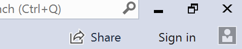
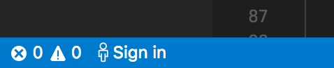
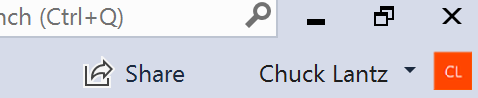
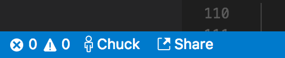

<!--
Copyright © Microsoft Corporation
All rights reserved.
Creative Commons Attribution 4.0 License (International): https://creativecommons.org/licenses/by/4.0/legalcode
-->

# Quickstart: Share your first project

Welcome to Visual Studio Live Share! Live Share lets you to achieve greater confidence at speed by streamlining collaborative editing, debugging, and more in real-time during development. You get real-time sharing in tools you love, can share the full context of your code, collaboratively edit while still navigating files independently, securely share local servers, and even collaboratively debug while still retaining the ability to inspect on your own.

Ready to get going?  Team collaboration should be so quick and natural, that it becomes harder not to do it! For this reason, Visual Studio Live Share makes it simple to get started, so that you can seamlessly begin sharing your work and ideas.

Just follow these steps to start sharing.

## 1. Install the extension

Installing the extension is easy. Just follow these steps:

<table style="width: 100%; border-style: none;">
<tr>
    <td style="width: 128px; text-align: center; border:none;"></td>
    <td>
        <strong>Visual Studio 2017 15.6 or higher</strong> 
       1. Install the latest update of <a href="https://www.visualstudio.com/vs/">VS 2017</a> (15.6+) on Windows (7, 8.1, or 10). 
       2. Install a supported workload. e.g. ASP.NET, .NET Core, and/or Node.js 
       3. Download and install the VS Live Share extension from the marketplace.  
        
    </td>
</tr>
<tr>
    <td style="width: 128px; text-align: center; border:none;"></td>
    <td>
        <strong>Visual Studio Code</strong> 
        1. Install <a href="https://code.visualstudio.com/">Visual Studio Code</a> (1.20.0+) for Windows (7, 8.1, or 10) or macOS <b>(Sierra & up).</b> 
        2. Download and install the VS Live Share extension from the marketplace.  
        3. Reload and wait for dependencies to download and install (see status bar). 
        
    </td>
</tr>
</table>

By downloading and using Visual Studio Live Share, you agree to the [license terms](https://aka.ms/vsls-license) and [privacy statement](https://www.microsoft.com/en-us/privacystatement/EnterpriseDev/default.aspx). See [troubleshooting](https://aka.ms/vsls-troubleshooting) if you run into problems.

## 2. Sign into Live Share

Once installed, start up your tool sign in with the **credentials that are associated with the email you used to sign up**. 

 

If you signed up with an email that **is not already tied to a Microsoft personal, work, or school account or a GitHub account**:
1. Add the email as a secondary address to your GitHub profile
2. Verify it
3. Sign in using GitHub
4. If this still doesn't work, email vsls-feedback@microsoft.com and we can swap your email out.

> **Tip:** Need to use a different sign-in for Visual Studio than your [personalization account](https://docs.microsoft.com/en-us/visualstudio/ide/signing-in-to-visual-studio)? Go to Tools &gt; Options &gt; Live Share &gt; User account.  

## 3. Start a collaboration session

Open a folder, project, or solution, and simply click "Share" within your tool and an invite link will be automatically copied to your clipboard. 

> **Note:** You may be asked by your desktop firewall software to allow the Live Share agent to open a port the first time you share. Accepting this is entirely optional but enables a secured "direct mode" to improve performance when the person you are working with is on the same network as you are. See [changing the connection mode](collab-session.md#changing-the-connection-mode) for details.

 

## 4. Send someone the invite link

Send the link over e-mail, Slack, Skype, etc. and when opened in a browser will allow them to join a collaboration session that shares contents of the folder, project, or solution you opened. 

Note that the **person you invite does not need to sign up or be accepted into the preview** and will not receive any email updates by simply signing in. The web page for the invite link contains everything they need to know to download, install needed tools, and join the collaboration session. (However, they will not be able to _create_ their own collaboration sessions until they've been accepted in the preview.)

## 5. Collaborate!

That's it!! Once your colleague has joined the collaboration session you'll be up and running!

## See also

- [Quickstart: Join your first session](quick-start-join.md)
- [Collaboration Session How-tos](collab-session.md)
- [Visual Studio Code How-tos](collab-vscode.md)
- [Visual Studio How-tos](collab-vsmd)

Reference
- [Language and platform support](platform-support.md)
- [Extension support](extensions.md)
- [Troubleshooting](troubleshooting.md)
- [Provide feedback](support.md)
